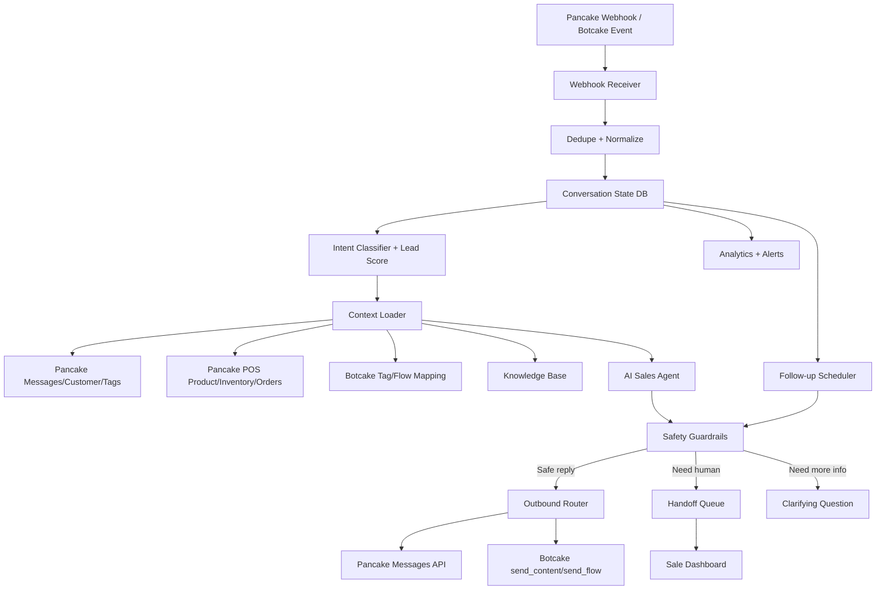

# Automation Workflow Blueprint - AI Sales Automation

Ngày cập nhật: 2026-06-10

## 1. Mục tiêu

Tài liệu này thiết kế workflow tự động thông minh cho dự án AI Sales Automation dựa trên API thật của Pancake, Pancake POS và Botcake.

Mục tiêu sản phẩm:

- Trả lời khách 24/7 nhanh, đúng, không bịa.
- Tăng tỉ lệ chốt đơn bằng tư vấn đúng sản phẩm, đúng tồn kho, đúng thời điểm.
- Không bỏ sót khách từ quảng cáo, inbox, comment và khách cũ.
- Gom vận hành vào dashboard riêng: inbox, sản phẩm, tồn kho, sale queue, follow-up, analytics.
- Sale vẫn duyệt các điểm nhạy cảm: đơn nháp, chính sách chưa chắc, khiếu nại, khách nóng.

## 2. Nguyên tắc thiết kế

| Nguyên tắc | Cách áp dụng |
| --- | --- |
| POS là nguồn thật | Giá, size, màu, variant, tồn kho, đơn hàng lấy từ Pancake POS |
| Pancake là nguồn hội thoại | Page, conversations, messages, customers, tags, webhooks lấy từ Pancake API |
| Botcake là lớp automation/chatbot | Flow, dynamic block, quick replies, tag/action dùng Botcake |
| AI không tự quyết định sâu khi thiếu dữ liệu | Thiếu sản phẩm/giá/tồn/chính sách -> hỏi lại hoặc handoff |
| Handoff phải có ngữ cảnh | Sale nhận summary, sản phẩm quan tâm, thông tin thiếu, lý do chuyển |
| Webhook phải nhanh và bền | Nhận event -> validate -> enqueue -> trả `200`, AI xử lý async |
| Không spam khách | Follow-up phải theo chính sách kênh, tần suất và trạng thái hội thoại |

## 3. Kiến trúc workflow tổng thể



## 4. Workflow 1 - Tin nhắn mới từ khách

### Trigger

- Pancake Webhook `messaging`.
- Hoặc Botcake webhook nếu sau này xác minh payload inbound.

### Các bước

1. Nhận webhook và trả `200` nhanh sau khi lưu/enqueue.
2. Dedupe bằng `message.id`.
3. Normalize thành `ConversationEvent`.
4. Kiểm tra message có phải từ khách không.
5. Load conversation state.
6. Classify intent:
   - hỏi sản phẩm
   - hỏi giá
   - hỏi size/màu
   - hỏi tồn kho
   - muốn mua
   - khiếu nại
   - cần người thật
   - spam/không liên quan
7. Tính lead score.
8. Load context từ POS/KB nếu cần.
9. AI tạo response candidate.
10. Safety Guardrails kiểm tra.
11. Outbound:
   - trả lời tự động nếu an toàn
   - hỏi lại nếu thiếu thông tin
   - handoff nếu không chắc hoặc khách nóng

### Lead score đề xuất

| Tín hiệu | Điểm |
| --- | ---: |
| Khách hỏi còn hàng/size/màu | +20 |
| Khách hỏi giá/ship | +20 |
| Khách gửi số điện thoại | +30 |
| Khách gửi địa chỉ | +30 |
| Khách nói muốn mua/chốt/lấy mẫu này | +40 |
| Khách từng mua trong POS | +20 |
| Khách chờ quá SLA | +15 |
| POS lỗi/không chắc | Không tăng điểm, chuyển handoff |

Ngưỡng:

- `0-29`: AI xử lý bình thường.
- `30-59`: khách tiềm năng, ưu tiên trả lời nhanh.
- `60-79`: khách nóng, gắn tag `Sẵn sàng chốt đơn`.
- `80+`: handoff sale ngay, giữ AI ở vai trò hỗ trợ ngắn gọn.

## 5. Workflow 2 - Khách hỏi sản phẩm/tồn kho

### Luồng chuẩn

```text
Khách hỏi sản phẩm
  -> Extract keyword/size/color/budget
  -> Search POS products/variations
  -> Filter hidden/locked/out-of-stock
  -> Rank sản phẩm phù hợp
  -> AI trả lời 1-3 lựa chọn tốt nhất
  -> Nếu thiếu size/màu thì hỏi lại
```

### Rule an toàn

- Không gợi ý sản phẩm `is_hidden` hoặc `is_locked`.
- Không nói "còn hàng" nếu inventory `unknown`.
- Nếu `low_stock`, nói còn ít và nên để sale kiểm tra trước khi chốt.
- Nếu sản phẩm hết hàng, gợi ý mẫu thay thế chỉ khi có dữ liệu thật.

### Response style

- Ngắn, tự nhiên, bán hàng nhưng không ép.
- Ưu tiên câu hỏi chốt nhẹ:
  - "Chị hay mặc size nào để em lọc đúng hơn ạ?"
  - "Chị thích màu nhã hay nổi hơn để em gửi mẫu hợp nhất ạ?"
  - "Mẫu này hiện còn ít, chị muốn em giữ thông tin để sale kiểm lại ngay không?"

## 6. Workflow 3 - Khách có ý định mua

### Trigger

- "lấy cái này"
- "chốt"
- "mua"
- gửi số điện thoại
- gửi địa chỉ
- hỏi cách đặt hàng

### Luồng

1. Gắn lead score cao.
2. Kiểm tra đầy đủ:
   - sản phẩm/variant
   - size
   - màu
   - số lượng
   - tên
   - số điện thoại
   - địa chỉ nếu giao hàng
   - tồn kho
3. Nếu thiếu thông tin, AI hỏi đúng một điểm quan trọng nhất.
4. Nếu đủ thông tin và draft order đã bật an toàn:
   - refresh tồn kho từ POS.
   - validate safe draft status.
   - tạo đơn nháp.
   - gắn tag `Đã tạo đơn nháp`.
   - handoff sale duyệt.
5. Nếu draft order chưa bật:
   - gắn tag `Sẵn sàng chốt đơn`.
   - tạo handoff summary.
   - sale chốt.

### Cấm

- Không nói "đơn đã xác nhận".
- Không tự chuyển status POS sang confirmed.
- Không tạo order nếu thiếu số điện thoại hoặc variant thật.

## 7. Workflow 4 - Handoff thông minh

### Trigger bắt buộc handoff

| Nhóm | Ví dụ |
| --- | --- |
| Khách yêu cầu người thật | "cho chị gặp nhân viên" |
| Mua hàng rõ ràng | gửi phone/address/chốt |
| POS lỗi | không kiểm được tồn kho/giá |
| Chính sách chưa chắc | đổi trả, bảo hành, phí ship đặc biệt |
| Khiếu nại | giao sai, chậm, hoàn tiền |
| AI không hiểu sau 2 lần | khách hỏi mơ hồ, sai chính tả nặng |
| Khách VIP/cũ có lịch sử mua lớn | cần sale chăm sóc trực tiếp |

### Handoff output

Handoff summary phải có:

- Lý do chuyển.
- Nhu cầu khách.
- Sản phẩm/variant quan tâm.
- Size/màu/số lượng nếu có.
- Thông tin đã biết.
- Thông tin còn thiếu.
- Lịch sử quan trọng.
- Đề xuất bước tiếp theo cho sale.

### API action

- Pancake API: gắn tag conversation, assign sale nếu đã cấu hình.
- Botcake: `send_content` với `actions.add_tag`, hoặc `send_flow` handoff.
- Nội bộ: tạo item trong Handoff Queue.

## 8. Workflow 5 - Khách im lặng

### Trigger

Khách không trả lời sau khi AI/sale hỏi một câu có mục tiêu.

### Mốc thời gian đề xuất

| Mốc | Điều kiện | Tin nhắn |
| --- | --- | --- |
| 15 phút | Khách nóng, đang hỏi mua | Nhắc nhẹ, hỏi có muốn giữ mẫu/kiểm size |
| 1 giờ | Đã tư vấn sản phẩm | Gửi 1 lựa chọn tốt nhất hoặc hỏi lại size/màu |
| 24 giờ | Chưa chốt | Gợi ý mẫu còn hàng hoặc hỏi cần sale hỗ trợ |
| 7 ngày | Khách từng quan tâm | Chăm sóc lại nếu chính sách kênh cho phép |

### Rule chống spam

- Không follow-up nếu khách đã yêu cầu dừng.
- Không gửi quá số lần cấu hình trong 24h.
- Không gửi ngoài policy window nếu kênh không cho phép.
- Nếu cần template/message tag, chỉ gửi khi đã xác minh chính sách.

### API action

- Lưu follow-up job nội bộ.
- Khi tới hạn, kiểm tra state mới nhất.
- Nếu vẫn phù hợp, gửi qua Botcake Flow/Automation hoặc Pancake Message API.
- Gắn tag `Khách cần nhắc lại` hoặc `Đã follow-up`.

## 9. Workflow 6 - Chăm sóc khách cũ

### Nguồn dữ liệu

- Pancake API: page customer, conversation, tag.
- Pancake POS: orders, customers, sản phẩm đã mua, giá trị mua.
- Knowledge Base: nhóm sản phẩm mới, chính sách ưu đãi.

### Segment đề xuất

| Segment | Điều kiện | Hành động |
| --- | --- | --- |
| Khách từng mua | Có order trong POS | Gợi ý sản phẩm mới phù hợp |
| Khách từng hỏi nhưng chưa mua | Có conversation, không có order | Follow-up nhẹ hoặc ưu đãi |
| Khách VIP | Tổng mua cao/nhiều đơn | Sale chăm sóc trực tiếp |
| Khách hỏi size cụ thể | Có size preference | Gửi mẫu mới đúng size |
| Khách thích nhóm sản phẩm | Lịch sử hỏi/mua cùng category | Gửi collection mới |

### Rule

- Không broadcast đại trà từ dự án nếu chưa xác minh policy.
- Ưu tiên dùng Botcake Flow/Automation đã được cấu hình hợp lệ.
- Mỗi chiến dịch phải có giới hạn tần suất và đo conversion.

## 10. Workflow 7 - Đồng bộ sản phẩm và Knowledge Base

### Luồng

```text
Every 5-15 minutes:
  -> POS product variations
  -> normalize Product/Variant/Inventory
  -> update Product Search Index
  -> mark hidden/locked/out-of-stock
  -> refresh dashboard product intelligence
```

### Knowledge Base

KB không thay thế POS. KB bổ sung:

- bảng size
- chất liệu
- chính sách
- script objection
- sản phẩm ưu tiên
- nhóm khách phù hợp

Nếu POS và KB lệch:

- Giá/tồn kho/variant: POS thắng.
- Chính sách/size/chất liệu: KB thắng nếu đã xác nhận.
- Nếu conflict không rõ: handoff.

## 11. Workflow 8 - Dashboard vận hành

### Màn hình bắt buộc

| Màn hình | Chức năng |
| --- | --- |
| Command Center | KPI, khách chờ, lỗi API, webhook health, đơn nháp |
| Unified Inbox | Hội thoại live, AI status, sale status, tag, lead score |
| Customer 360 | Lịch sử chat, lịch sử mua, tag, note, sản phẩm quan tâm |
| Product Intelligence | Search sản phẩm, tồn kho, mẫu thay thế, hàng sắp hết |
| Handoff Center | Queue khách nóng, summary, assign sale, SLA |
| Follow-up Planner | Lịch nhắc khách im lặng, khách cũ, campaign |
| Automation Rules | Rule bật/tắt, tag mapping, flow mapping, safety gate |
| Revenue Analytics | Đơn nháp, conversion, nguồn ads, sale performance |
| Risk Center | POS lỗi, Botcake/Pancake lỗi, webhook suspension risk |

### UX cho người không rành code

- Không bắt nhìn log kỹ thuật.
- Dùng trạng thái: `Sẵn sàng`, `Cần cấu hình`, `Đang lỗi`, `Đang chờ sale`.
- Nút thao tác rõ:
  - Kiểm tra kết nối
  - Đồng bộ sản phẩm
  - Test webhook
  - Test gửi tin nội bộ
  - Tạo mapping tag
  - Bật/tắt follow-up

## 12. Prioritized build plan

### P0 - Nền móng bắt buộc

- Pancake API config/token layer.
- POS + Botcake config đang có.
- Database schema: conversation, message, customer, product snapshot, job, handoff.
- Webhook receiver trả `200` nhanh.
- Idempotency.

### P1 - Unified Inbox thật

- Pancake `GET /pages`.
- Pancake `GET /conversations`.
- Pancake `GET /messages`.
- Webhook messaging.
- UI inbox + customer timeline.

### P2 - AI Sales Agent

- Intent classifier.
- Product context from POS.
- Safe response builder.
- Botcake/Pancake outbound router.
- Handoff summary.

### P3 - Handoff + sale workflow

- Tag mapping Pancake/Botcake.
- Assign sale.
- Handoff queue.
- SLA alert.

### P4 - Follow-up engine

- Scheduler.
- Quiet customer detection.
- Old customer segments.
- Botcake Flow/Automation trigger.

### P5 - Draft order

- Validate safe draft status.
- Create POS draft order.
- Sale approval flow.
- Analytics.

## 13. Dữ liệu cần anh cung cấp tiếp

Để build bản Unified Inbox và workflow thật, cần thêm:

| Dữ liệu | Lý do |
| --- | --- |
| `PANCAKE_API_USER_ACCESS_TOKEN` | Tự lấy danh sách page và generate page token |
| `PANCAKE_API_PAGE_ACCESS_TOKEN` | Gọi conversations/messages/customers/tags |
| Page muốn bật webhook | Gửi Pancake support enable webhook |
| Domain HTTPS webhook | Pancake gọi event real-time |
| Tag/flow mapping mong muốn | Handoff/follow-up đúng quy trình shop |
| PSID/test customer nội bộ | Test gửi tin không ảnh hưởng khách thật |
| Bảng size/chính sách thật | AI tư vấn không bịa |
| Quy tắc sale trực | SLA và handoff đúng giờ |

## 14. Kết luận

Thiết kế tốt nhất là **không cố thay Pancake/POS/Botcake**, mà biến dự án thành lớp vận hành thông minh ở trên:

- Pancake API kéo hội thoại, page, khách, tag, webhook.
- Botcake điều khiển automation/flow/chatbot action.
- Pancake POS cung cấp sản phẩm, tồn kho, đơn hàng.
- AI Orchestrator ra quyết định, tư vấn, nhắc lại, chấm điểm khách và chuyển sale.

Với thiết kế này, dự án có thể tiện hơn việc mở 3 hệ thống riêng vì mọi quyết định bán hàng nằm trong một dashboard: khách nào cần trả lời, nên tư vấn gì, còn hàng không, có nên nhắc lại không, sale nào cần xử lý và kết quả bán hàng ra sao.
