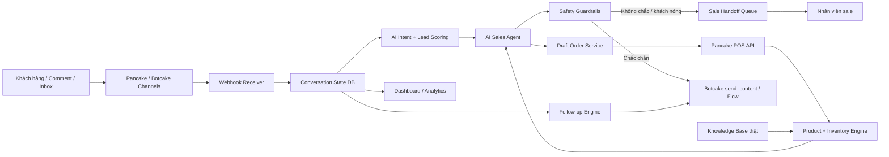

# Unified AI Sales Hub - Thiết kế sản phẩm gom Pancake, Pancake POS và Botcake

Ngày cập nhật: 2026-06-10

## 1. Mục tiêu sản phẩm

AI Sales Automation không chỉ là chatbot trả lời tin nhắn. Sản phẩm hoàn chỉnh cần trở thành **trung tâm vận hành bán hàng 24/7** cho shop, gom các năng lực đang nằm rải rác trong Pancake, Pancake POS và Botcake vào một dashboard riêng:

- Nhận biết khách đang hỏi gì, đang ở giai đoạn nào và có khả năng mua cao hay thấp.
- Tư vấn bằng AI dựa trên sản phẩm, giá, size, màu, tồn kho và chính sách thật.
- Không bỏ sót khách từ quảng cáo, comment, inbox và khách cũ.
- Gợi ý sản phẩm, xử lý từ chối, nhắc lại khách im lặng và tạo đơn nháp an toàn.
- Chuyển sale đúng lúc với tóm tắt rõ ràng để người thật chốt nhanh.
- Theo dõi hiệu suất bán hàng, khách nóng, hàng sắp hết và các lỗi cần xử lý.

Nguyên tắc quan trọng: **Pancake ecosystem vẫn là hạ tầng chính**, còn dự án này là lớp AI + điều phối + quản trị tập trung ở bên trên. Không thay thế bằng hệ thống bên thứ ba ngoài hệ Pancake.

## 2. Đối chiếu tài liệu chính thức

| Nguồn | Vai trò trong dự án | Kết luận thiết kế |
| --- | --- | --- |
| Pancake POS Open API: `https://api-docs.pancake.vn/` | Sản phẩm, biến thể, kho, đơn hàng | POS là nguồn dữ liệu chuẩn cho giá/tồn kho/variant/order. Không tự tạo dữ liệu sản phẩm trong AI. |
| Pancake Docs - Pancake API: `https://docs.pancake.biz/pancake/st-f12/st-p1?lang=en` | Tin nhắn, hội thoại và các thao tác trong Pancake | Có thể dùng Pancake làm nguồn hội thoại/timeline nếu API chi tiết được cấp quyền đầy đủ. Cần xác minh endpoint cụ thể trước khi code. |
| Pancake Docs - Webhooks: `https://docs.pancake.biz/pancake/st-f12/st-p2?lang=en` | Đồng bộ sự kiện real-time | Cần webhook public HTTPS để nhận event và cập nhật state. |
| Botcake API References: `https://docs.pancake.biz/botcake/st-f7/st-p2?lang=vi` | Gửi nội dung, flow, tag theo Botcake Public API | Botcake là kênh chatbot/automation chính. Source đang dùng `access-token` và route theo `page_id`. |
| Botcake Dynamic Block Docs: `https://docs.pancake.biz/botcake/st-f7/st-p1?lang=vi` | Message blocks, quick replies, action/tag | Dùng cho kịch bản trả lời động và tag/handoff trong Botcake Flow. |

## 3. Có tự lấy Page ID/Shop ID qua API được không?

| Hệ thống | Có tự lấy được không? | Cách làm an toàn |
| --- | --- | --- |
| Pancake POS Shop ID | Có | Gọi `GET /shops` bằng `PANCAKE_POS_API_KEY`, sau đó chọn shop thật. Source đã kiểm tra được shop thật local. |
| Pancake POS Warehouse ID | Có | Gọi `GET /shops/{SHOP_ID}/warehouses`, chọn kho mặc định để tư vấn tồn kho. |
| Botcake Page ID | Chưa thấy endpoint public chính thức để list toàn bộ page trong tài liệu đã mở | Botcake Public API dùng `page_id` trong URL. Source đã hỗ trợ tự suy ra Page ID từ `BOTCAKE_API_TOKEN` nếu token là JWT có field `id`; vẫn nên xác minh page/bot trên giao diện Botcake. |
| Pancake page/channel IDs | Cần xác minh thêm | Pancake Docs có mục API cho messages/conversations, nhưng cần API list chi tiết và quyền tài khoản trước khi code auto-discovery. |

Kết luận: với POS có thể tự động hóa khá tốt. Với Botcake, hiện thiết kế tốt nhất là **nhập token trước, tự suy ra Page ID nếu được, sau đó kiểm tra lại bằng API tag thật**.

## 4. Kiến trúc sản phẩm hoàn chỉnh

## 5. Các module chính cần có

| Module | Chức năng | Dữ liệu đầu vào | Kết quả |
| --- | --- | --- | --- |
| Integration Discovery | Kiểm tra token, shop, kho, tag, flow | `.env`, Botcake, POS | Dashboard báo kết nối thật, thiếu gì chỉ rõ |
| Webhook Receiver | Nhận event hội thoại real-time | Pancake/Botcake webhook | Chuẩn hóa event, chống duplicate, đưa vào state |
| Conversation State | Lưu trạng thái từng khách | message, intent, tag, đơn nháp | Biết khách đang hỏi gì, đã tư vấn gì, cần nhắc lại lúc nào |
| Product Knowledge Engine | Tìm sản phẩm đúng nhu cầu | POS product/variant/inventory + Knowledge Base | Gợi ý sản phẩm có hàng, đúng size/màu/giá |
| AI Sales Agent | Trả lời và tư vấn bán hàng | prompt, state, sản phẩm thật | Tin nhắn tự nhiên, đúng giọng Chị Hương, không bịa |
| Safety Guardrails | Chặn lỗi AI/API | rule handoff, tồn kho, chính sách | Cho phép trả lời, yêu cầu hỏi lại hoặc chuyển sale |
| Handoff Queue | Đưa khách nóng cho sale | summary + tag + reason | Sale xử lý nhanh, không phải đọc lại toàn bộ chat |
| Follow-up Engine | Nhắc khách im lặng và chăm sóc khách cũ | state, lịch, tag, chính sách kênh | Tăng tỉ lệ quay lại và giảm bỏ sót |
| Draft Order Service | Tạo đơn nháp an toàn | customer info + variant thật + qty | Đơn nháp chờ sale duyệt, không tự xác nhận |
| Analytics Dashboard | Đo hiệu quả vận hành | message, handoff, đơn nháp, lỗi | Biết tỉ lệ phản hồi, khách nóng, sản phẩm bán tốt |

## 6. Trải nghiệm UI nên có

Dashboard nên đi theo phong cách admin thương mại: rõ, nhanh, nhiều thông tin vận hành, không phải landing page.

Màn hình cần có:

| Màn hình | Mục tiêu |
| --- | --- |
| Tổng quan | Kết nối API, khách đang chờ, khách nóng, lỗi hệ thống, sản phẩm hết hàng |
| Unified Inbox | Xem hội thoại theo trạng thái: AI đang xử lý, cần sale, đã tạo đơn nháp, cần follow-up |
| Lead Scoring | Xếp hạng khách nóng dựa trên intent mua, hỏi giá/size/ship, lịch sử mua, thời gian chờ |
| Product Intelligence | Tìm sản phẩm, tồn kho, biến thể, sản phẩm thay thế khi hết hàng |
| Handoff Center | Sale nhận khách với tóm tắt, sản phẩm quan tâm, lý do chuyển, bước đề xuất |
| Follow-up Planner | Cấu hình mốc nhắc lại: 15 phút, 1 giờ, 24 giờ, 7 ngày, khách cũ có sản phẩm mới |
| Knowledge Base Manager | Nhập/chỉnh chính sách, bảng size, script objection, sản phẩm ưu tiên |
| Automation Rules | Bật/tắt rule an toàn, tag, flow, lịch nhắc |
| Revenue Analytics | Tin nhắn, khách nóng, đơn nháp, tỉ lệ chuyển sale, tỉ lệ chốt theo nguồn quảng cáo |

## 7. Tính năng tăng tỉ lệ chốt đơn nên ưu tiên

1. **Phản hồi tức thì theo ngữ cảnh**: khách nhắn từ quảng cáo nào, hỏi sản phẩm nào, AI trả lời đúng sản phẩm đó trước.
2. **Tư vấn có tồn kho real-time**: chỉ gợi ý size/màu còn hàng; nếu hết hàng thì gợi ý mẫu tương tự.
3. **Lead scoring**: khách hỏi giá, ship, size, chốt địa chỉ, số điện thoại được đẩy lên hàng đầu.
4. **Handoff thông minh**: khách nóng hoặc câu hỏi không chắc được chuyển sale với tóm tắt, tag, sản phẩm quan tâm.
5. **Nhắc lại khách im lặng**: sau khoảng thời gian cấu hình, gửi tin nhắc nhẹ nếu chính sách kênh cho phép.
6. **Chăm sóc khách cũ**: phân nhóm khách từng mua/từng chat để gửi sản phẩm mới, ưu đãi, hoặc gợi ý phù hợp.
7. **Chống bỏ sót**: dashboard cảnh báo khách chưa được trả lời quá SLA hoặc webhook/API lỗi.
8. **Tạo đơn nháp sau khi đủ dữ liệu**: AI thu tên, số điện thoại, địa chỉ, sản phẩm, size, màu; hệ thống tạo draft để sale duyệt.
9. **Objection handling**: xử lý các câu như đắt, sợ không vừa, hỏi chất liệu, hỏi đổi trả bằng script thật từ shop.
10. **Đo nguồn quảng cáo**: nếu payload/ad context có sẵn, gắn vào state để biết chiến dịch nào tạo khách chất lượng.

## 8. Rule an toàn bắt buộc

- Không tự xác nhận đơn hoàn tất.
- Không nói chắc giá/tồn kho nếu POS lỗi hoặc thiếu dữ liệu.
- Không bịa size, chất liệu, chính sách đổi trả.
- Không gửi follow-up nếu vượt chính sách kênh hoặc thiếu consent cần thiết.
- Không log token, API key, số điện thoại đầy đủ nếu chưa có cơ chế redaction phù hợp.
- Mọi lỗi API quan trọng phải có timeout, retry giới hạn và fallback handoff.

## 9. Roadmap triển khai thực tế

### Phase A - Discovery và cấu hình thật

- Tự lấy POS shops/warehouses.
- Tự suy ra Botcake Page ID từ token nếu có thể.
- Đọc tag Botcake thật, sản phẩm/kho POS thật.
- Dashboard báo rõ thiếu gì, không in secret.

### Phase B - Webhook và state

- Tạo webhook HTTPS public.
- Capture payload thật từ Pancake/Botcake.
- Lưu conversation state, idempotency, customer profile.
- Chống duplicate/retry webhook.

### Phase C - AI tư vấn sản phẩm

- Product search từ POS.
- Knowledge Base thật cho size/chính sách.
- AI trả lời theo prompt Chị Hương.
- Guardrail chặn bịa và tự handoff khi không chắc.

### Phase D - Handoff và sale workflow

- Gắn tag/flow đúng.
- Dashboard hàng chờ sale.
- Tóm tắt hội thoại chuẩn theo `docs/handoff-protocol.md`.
- SLA cảnh báo khách nóng chưa được xử lý.

### Phase E - Follow-up và chăm sóc khách cũ

- Nhắc khách im lặng theo thời gian cấu hình.
- Phân nhóm khách cũ, khách từng hỏi, khách từng mua.
- Gửi sản phẩm mới/ưu đãi qua Botcake Flow/Automation khi được phép.
- Theo dõi tỉ lệ quay lại và tỉ lệ chốt.

### Phase F - Draft order và analytics

- Xác minh trạng thái draft POS an toàn.
- Tạo đơn nháp khi đủ thông tin.
- Sale duyệt cuối.
- Dashboard đo đơn nháp, doanh thu, tỉ lệ chuyển đổi.

## 10. Những điểm cần xác minh thêm

- Endpoint Pancake API chi tiết để list page/channel/conversation nếu tài khoản được cấp quyền.
- Payload webhook thật của kênh shop đang dùng: Facebook, Zalo, Instagram hoặc kênh khác.
- Cơ chế xác thực webhook chính thức của Botcake/Pancake trong tài khoản hiện tại.
- Flow ID và tag ID thật cho handoff, follow-up, khách nóng, khách cũ.
- Status đơn nháp an toàn trong POS shop thật.
- Chính sách gửi tin lại theo từng kênh để tránh spam hoặc vi phạm quy định nền tảng.

## 11. Kết luận thiết kế

Thiết kế tốt nhất là xây dự án này thành **AI Sales Control Center**:

- Pancake/Botcake giữ vai trò kênh chat, flow, tag, automation.
- Pancake POS giữ vai trò nguồn dữ liệu sản phẩm, tồn kho và đơn hàng.
- Dự án của mình giữ vai trò bộ não AI, dashboard vận hành, rule an toàn, follow-up, handoff và đo hiệu quả bán hàng.

Khi hoàn chỉnh, chủ shop không cần mở qua lại nhiều nơi để hiểu khách đang ở đâu. Dashboard riêng sẽ cho biết khách nào cần chốt ngay, AI đã tư vấn gì, sản phẩm nào còn hàng, lỗi nào cần xử lý và khách nào nên được chăm sóc lại.
